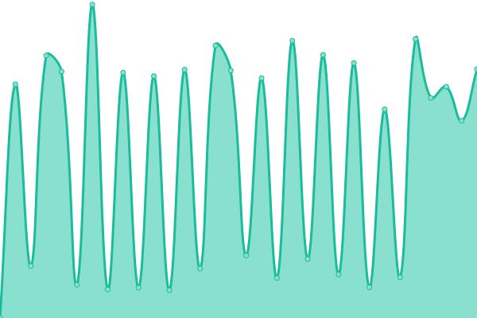

# [📈 Live Status](https://mvaneijgen.github.io/provider-upptime): <!--live status--> **🟧 Partial outage**

This repository contains the open-source uptime monitor and status page for [mvaneijgen](https://mvaneijgen.github.io/provider-upptime), powered by [Upptime](https://github.com/upptime/upptime).

With [Upptime](https://upptime.js.org), you can get your own unlimited and free uptime monitor and status page, powered entirely by a GitHub repository. We use [Issues](https://github.com/mvaneijgen/provider-upptime/issues) as incident reports, [Actions](https://github.com/mvaneijgen/provider-upptime/actions) as uptime monitors, and [Pages](https://mvaneijgen.github.io/provider-upptime) for the status page.

<!--start: status pages-->
<!-- This summary is generated by Upptime (https://github.com/upptime/upptime) -->
<!-- Do not edit this manually, your changes will be overwritten -->
<!-- prettier-ignore -->
| URL | Status | History | Response Time | Uptime |
| --- | ------ | ------- | ------------- | ------ |
|  [AH Support](http://ahsupport.boehringer-ingelheim.be) | 🟩 Up | [ah-support.yml](https://github.com/mvaneijgen/provider-upptime/commits/HEAD/history/ah-support.yml) | 

 1990ms
     
 | 

<a href="https://mvaneijgen.nl/history/ah-support">100.00%</a>
    

|  [JAM](http://jointacademymicroport.com) | 🟩 Up | [jam.yml](https://github.com/mvaneijgen/provider-upptime/commits/HEAD/history/jam.yml) | 

 529ms
     
 | 

<a href="https://mvaneijgen.nl/history/jam">100.00%</a>
    

|  [JAM US](http://microportjam.com) | 🟩 Up | [jam-us.yml](https://github.com/mvaneijgen/provider-upptime/commits/HEAD/history/jam-us.yml) | 

 530ms
     
 | 

<a href="https://mvaneijgen.nl/history/jam-us">100.00%</a>
    

|  [Pigge](http://vanderpigge.nl) | 🟩 Up | [pigge.yml](https://github.com/mvaneijgen/provider-upptime/commits/HEAD/history/pigge.yml) | 

 1623ms
     
 | 

<a href="https://mvaneijgen.nl/history/pigge">100.00%</a>
    

|  [DGO](https://degroeneos.nl) | 🟩 Up | [dgo.yml](https://github.com/mvaneijgen/provider-upptime/commits/HEAD/history/dgo.yml) | 

 864ms
     
 | 

<a href="https://mvaneijgen.nl/history/dgo">100.00%</a>
    

|  [PQ](https://pq-opleidingen.nl) | 🟩 Up | [pq.yml](https://github.com/mvaneijgen/provider-upptime/commits/HEAD/history/pq.yml) | 

 1507ms
     
 | 

<a href="https://mvaneijgen.nl/history/pq">99.85%</a>
    

|  [Spaarnesant](https://spaarnesant.nl) | 🟩 Up | [spaarnesant.yml](https://github.com/mvaneijgen/provider-upptime/commits/HEAD/history/spaarnesant.yml) | 

 1552ms
     
 | 

<a href="https://mvaneijgen.nl/history/spaarnesant">100.00%</a>
    

|  [Sint Jacob](https://sintjacob.nl) | 🟥 Down | [sint-jacob.yml](https://github.com/mvaneijgen/provider-upptime/commits/HEAD/history/sint-jacob.yml) | 

 0ms
     
 | 

<a href="https://mvaneijgen.nl/history/sint-jacob">0.00%</a>
    

<!--end: status pages-->

[**Visit our status website →**](https://mvaneijgen.github.io/provider-upptime)

## 📄 License

- Powered by: [Upptime](https://github.com/upptime/upptime)
- Code: [MIT](./LICENSE) © [Anand Chowdhary](https://anandchowdhary.com), supported by [Pabio](https://pabio.com)
- Data in the `./history` directory: [Open Database License](https://opendatacommons.org/licenses/odbl/1-0/)
